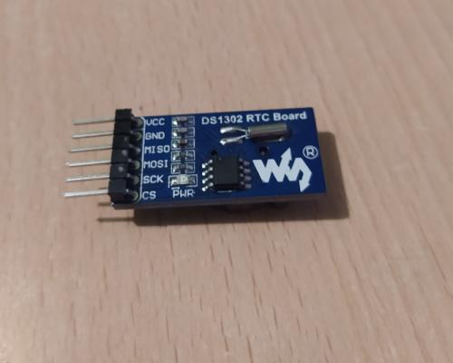
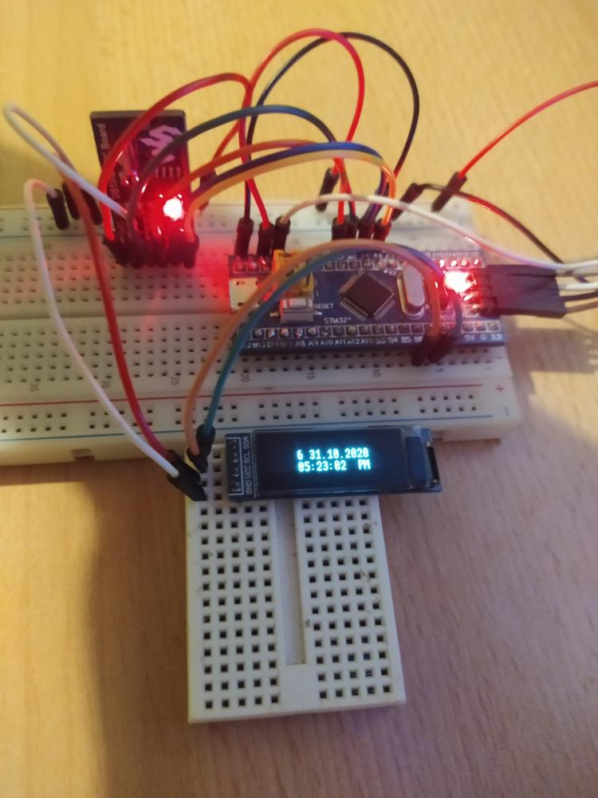

# ds1302-rs
 DS1302 real time clock-calendar platform agnostic driver 



 # About
 
 DS1302 is a real time clock/calendar (RTCC) chip, which communicates with SPI interface.  
 The device provides seconds, minutes, hours, day, date, month, and year information.
 Driver is based on [`embedded-hal`] traits.
 
 [`embedded-hal`]: https://github.com/rust-embedded/embedded-hal
 
 Datasheet: [DS1302](https://datasheets.maximintegrated.com/en/ds/DS1302.pdf)
 
 ## Hardware requirements
 - Very importand: SPI frame format with **LSB transmitted first!**
 - SPI speed less than 2 MHz
 - CPOL: CK to 0 when idle, CPHA: the first clock transition is the first data capture edge
 - Default 8-bit data frame format is selected for transmission/reception
 
 ## Stm32 BluePill board connected to I2C oled display with DS1302 RTCC 
 
 
 
 More in -> https://github.com/Nekspire/ds1302-rs/tree/master/examples
 
 ## The driver allows to:
 
 - Read and set clock and calendar data in 12-hour or 24-hour format .
 - Changing hour format without reseting it. `set_clock_mode()`
 
 ## The driver does not allow to:
 
 - Currently using RAM is not supported.
 
 ## Initialization
 
 ```
 // External crates for IO and strings manipulation 
 use core::fmt::Write;
 use heapless::String;
 // DS1302 driver crate
 use ds1302::{DS1302, Hours, Clock, Calendar, Mode as ds1302_mode};
 
 // Create with DS1302::new(), specify hour format mode: ds1302_mode::Hour12, in this case
 let mut ds1302 = DS1302::new(spi, cs, ds1302_mode::Hour12).unwrap();
 
 ```
  ## Read time and date
 ```
 let mut data = String::<U32>::from(" ");
 let mut text = " ";

 let cl = ds1302.get_clock_calendar().unwrap();
 // Check the current mode. If it is Hour12, check AM/PM value. Please refer to table description below.
 match ds1302.mode {
     ds1302_mode::Hour12 => {
         if cl.0.hours.am_pm == 1 {text = " PM"}
         else {text = " AM"}
     }
     ds1302_mode::Hour24 => text = ""
 }
 // Glue cl reads in string called "data", and use it later ...
 let _=write!(data,"{} {}.{}.{}\n{:02}:{:02}:{:02} {}",
             cl.1.day, cl.1.date, cl.1.month, cl.1.year,
             cl.0.hours.hours, cl.0.minutes, cl.0.seconds, text);
 ```
 
 
 From lib.rs:
 ```
 pub struct Hours {
     pub hours: u8,
     pub am_pm: u8,
 } 
 
 pub enum Mode {
     Hour24,
     Hour12,
 }
 ```
 ## Variants of time format depending on Mode::Hour24, Mode::Hour12 and Hours::am_mp
 
 Mode | am_pm | time format
 --- | --- | ---
 Hour12 | 0 | AM
 Hour12 | 1 | PM
 Hour24 | 0 | -
 Hour24 | 1 | -
 
 
 ## Set time and date
 
 ```
 let h = Hours {hours: 4, am_pm: 1};
 let clk = Clock {
     hours: h,
     minutes: 29,
     seconds: 0
 };
 let cal = Calendar {
     day: 2,
     date: 27,
     month: 10,
     year: 2020
 };
 ds1302.set_clock_calendar(clk, cal).unwrap();
 
 ```
 
